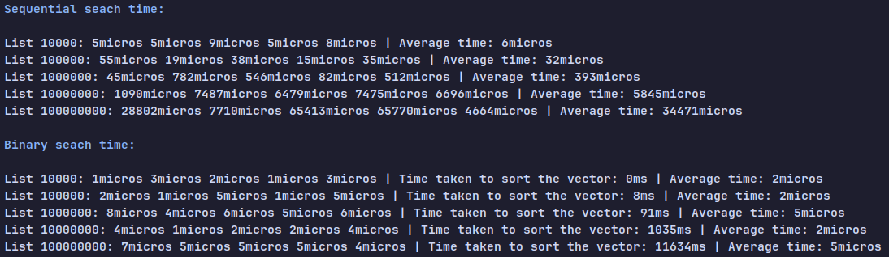

# Comparison of search algorithms
This comparison goes beyond 2 search algorithms and also compares a compiled language and an interpreted one.

### 🦀 Rust:

	

---

### 🌙 Lua:

	

---

### 🇨 CPP:

    

